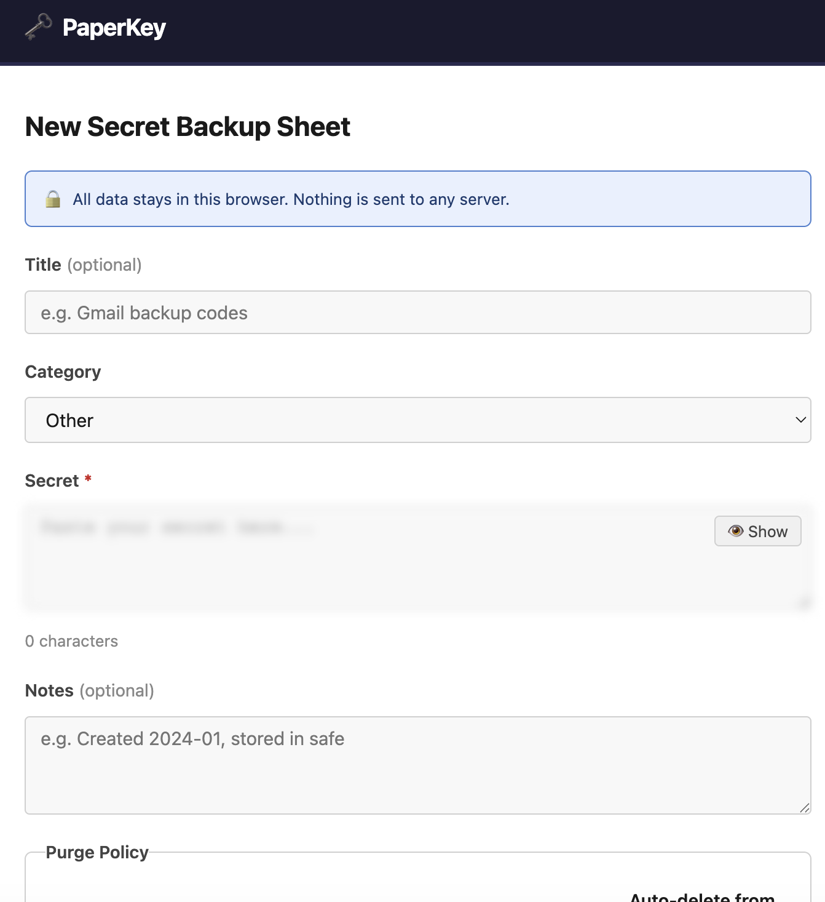
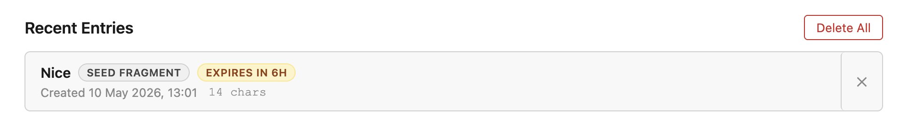
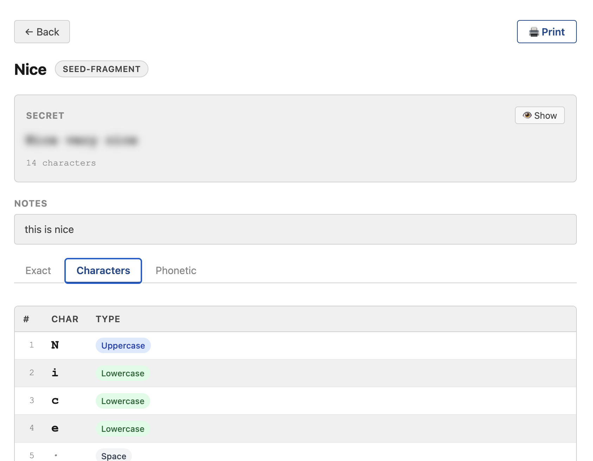
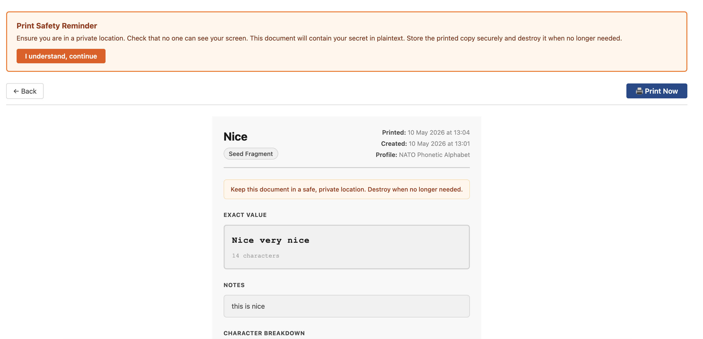

# PaperKey

<p align="center">
  
</p>

<p align="center"><em>Prepare sensitive strings for print, backup, and verbal recovery.</em></p>

<p align="center">
  <strong>All data stays in your browser. Nothing is sent to any server.</strong>
</p>

---

## Screenshots

| New entry | History | Character detail | Print view |
|-----------|---------|-----------------|------------|
|  |  |  |  |

---

## What is PaperKey?

PaperKey is a static, privacy-first web app for turning sensitive strings — passwords, recovery codes, seed fragments, 2FA backup codes, API keys — into formats that are easy to read exactly, communicate verbally, and print to paper.

Paste a secret and instantly get three views: the exact string, a character-by-character breakdown, and a phonetic representation (NATO alphabet by default, fully configurable). All processing happens in the browser. Nothing leaves your device.

It is not a password manager. It is a temporary preparation and print tool for physical backup and controlled verbal sharing.

---

## Features

- **Three output views** — exact text, character-by-character table, configurable phonetic / spoken representation
- **Phonetic profiles** — NATO/ICAO by default; add custom profiles or per-instance JSON configuration
- **Case-aware output** — uppercase and lowercase letters are explicitly distinguished (`Alpha (capital A)` vs `Alpha (lowercase a)`)
- **Symbol coverage** — hyphens, underscores, punctuation, and special characters are named, not silently skipped
- **Print-ready layout** — clean A4/Letter output via browser print dialog, no UI chrome, monospaced secret font
- **Local-only history** — stored in IndexedDB, never leaves the device; auto-purge with a default 1-hour TTL
- **Purge controls** — delete one entry, delete all, or configure automatic expiry per entry
- **PWA** — works offline after the first load, installable on desktop and mobile
- **No backend, no accounts, no analytics, no third-party scripts**

---

## Privacy & Security

- All secrets are processed entirely in the browser.
- History is stored in IndexedDB on your device only — not synced anywhere.
- You can disable history entirely, or configure entries to auto-delete after 10 minutes, 1 hour, 24 hours, or 7 days.
- There are no external fonts, no CDN dependencies, and no telemetry.
- A print safety reminder is shown before printing, noting that printer spools and saved PDFs create additional sensitive copies.

See [docs/spec.md](docs/spec.md) for the full security model and storage limitations.

---

## Getting started

```bash
npm install
npm run dev
```

Open `http://localhost:5173`.

Run unit tests:

```bash
npm test
```

Run end-to-end tests (requires a running dev server):

```bash
npm run test:e2e
```

---

## Self-hosting

Build a static site and deploy the `dist/` folder to any static host:

```bash
npm run build
```

The app is configured for GitHub Pages deployment. If you host it at a subpath, update the `base` option in `vite.config.ts` to match.

CI/CD workflows for GitHub Actions are included in `.github/workflows/`.

---

## Docs

- [Full specification](docs/spec.md) — functional requirements, data model, UI/UX, acceptance criteria
- [Roadmap & open tasks](docs/todo.md) — prioritised implementation backlog

---

## License

MIT
